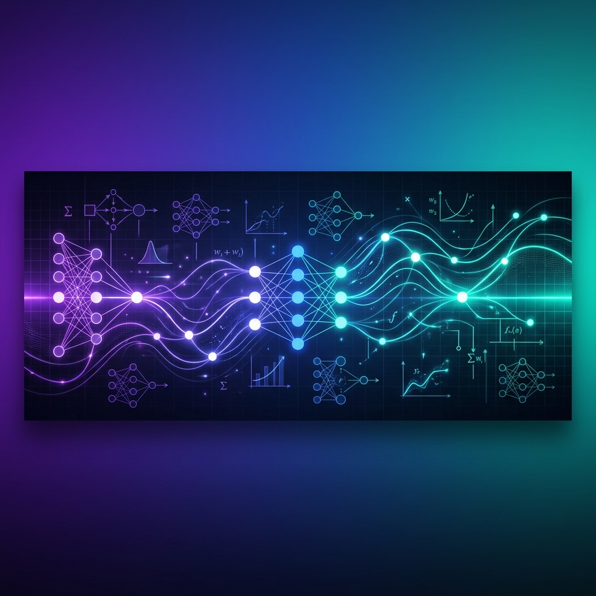

# Satwik Kumar (SatAi999) 👋

  

 

  

 

  
  &nbsp;&nbsp;
  
  &nbsp;&nbsp;
  

---

## 🚀 About Me

I am a passionate **Machine Learning Engineer & AI Practitioner** dedicated to building intelligent agentic systems, robust Retrieval-Augmented Generation (RAG) architectures, and production-grade computer vision pipelines. I specialize in designing autonomous workflows using **LangGraph** and integrating external tools via the **Model Context Protocol (MCP)**.

*   🔭 **Currently Focused On:** Scalable multi-agent systems and custom AutoML pipelines.
*   🌱 **Learning & Researching:** Advanced visual search engines and LLM reasoning loops.
*   💬 **Ask me about:** AI Agent design, LangGraph architectures, RAG optimization, and Image Restoration.
*   📫 **Connect with me:** [LinkedIn](https://www.linkedin.com/in/satwik-kumar-606574166) | [Email](mailto:kumarswastik30@gmail.com)

---

## 🛠️ Core Tech Stack

| Section | Tech Stack |
| :--- | :--- |
| **🧠 ML / DL & AI** |       |
| **🤖 Agentic Frameworks & LLM Ops** |     |
| **🌐 Infrastructure & DB** |       |

---

## 📁 Featured Projects

- **[AI Real Estate Advisor (MCP)](https://github.com/SatAi999/AI-Real-Estate-Advisor-MCP-Powered-Intelligent-Property-Recommendation-Engine)**
  > An intelligent property recommendation engine utilizing the Model Context Protocol (MCP) and local LLaMA models for transparent, multi-dimensional decision intelligence.
  > 
  > `Agentic AI` `Model Context Protocol` `LLM Reasoning` `Python`

- **[AutoForge ML](https://github.com/SatAi999/AutoForge_ML-Production-Grade-AutoML-Pipeline-with-Dataset-Model-Versioning)**
  > A production-grade AutoML pipeline demonstrating complete MLOps reproducibility with DVC data versioning, MLflow experiment tracking, and an interactive Streamlit monitoring dashboard.
  > 
  > `MLOps` `MLflow` `DVC` `AutoML` `Streamlit`

- **[Resume & JD Analyzer Agent](https://github.com/SatAi999/Resume-JD-Analyzer-Agent-Using-LangGraph)**
  > An enterprise recruitment copilot built on LangGraph. Orchestrates a multi-agent workflow to parse resumes, perform weighted criteria scoring, and generate detailed reasoning for candidate-job fits.
  > 
  > `LangGraph` `Multi-Agent Systems` `Ollama` `Information Extraction`

- **[QualityOS](https://github.com/SatAi999/QualityOS---Multi-Agent-Autonomous-Testing-And-Quality-Engineering-Platform)**
  > A multi-agent autonomous testing and quality engineering platform designed to run automated end-to-end testing cycles using AI reasoning loops.
  > 
  > `AI Agents` `Autonomous Testing` `Quality Engineering` `Python`

- **[APIFormer](https://github.com/SatAi999/APIFormer-A-Cognitive-Transformer-Architecture-for-Intelligent-API-Observability)**
  > A cognitive transformer architecture engineered for intelligent API observability, anomaly tracking, and contextual traffic analysis.
  > 
  > `Transformers` `Deep Learning` `Observability` `Anomaly Detection`

- **[ECG Arrhythmia Detection](https://github.com/SatAi999/Arrhythmia_Detection)**
  > A research-grade deep learning pipeline for cardiac arrhythmia detection in ECG signals using Convolutional Variational Autoencoders (VAE) and multi-strategy anomaly voting.
  > 
  > `Deep Learning` `PyTorch` `ECG Analysis` `Anomaly Detection`

- **[Monocular Camera Calibration & Distance Estimation](https://github.com/SatAi999/Camera-Calibration-Real-World-Distance-Measurement-System)**
  > A precise monocular computer vision system utilizing Zhang's camera calibration, ray-ground intersection geometry, and Monte Carlo uncertainty modeling to measure distance.
  > 
  > `Computer Vision` `OpenCV` `Camera Calibration` `Geometry`

- **[Investor Presentation RAG](https://github.com/SatAi999/Investor_Presentation_Rag)**
  > A conversational Q&A system for financial slide presentations featuring page-level citations, vector indices, and a dual-role React + Admin dashboard UI.
  > 
  > `RAG` `Qdrant` `React / Vite` `FastAPI`

- **[AI Decision Tree Agent](https://github.com/SatAi999/AI-Decision-Tree-Agent-Using-LangGraph)**
  > An agentic control pipeline that traverses complex decision trees using LangGraph state machines for transparent, auditable AI logical reasoning.
  > 
  > `LangGraph` `Decision Systems` `AI Control` `Python`

- **[Visual Search Engine](https://github.com/SatAi999/Visual-Search-Engine)**
  > A visual search engine designed to perform semantic image retrieval and similarity matching using deep feature embeddings.
  > 
  > `Deep Learning` `Image Retrieval` `Embeddings` `PyTorch`

---

## 📊 Live GitHub Stats & Activity

  

---

  
💡 <i>"The best way to predict the future is to build it."</i>

